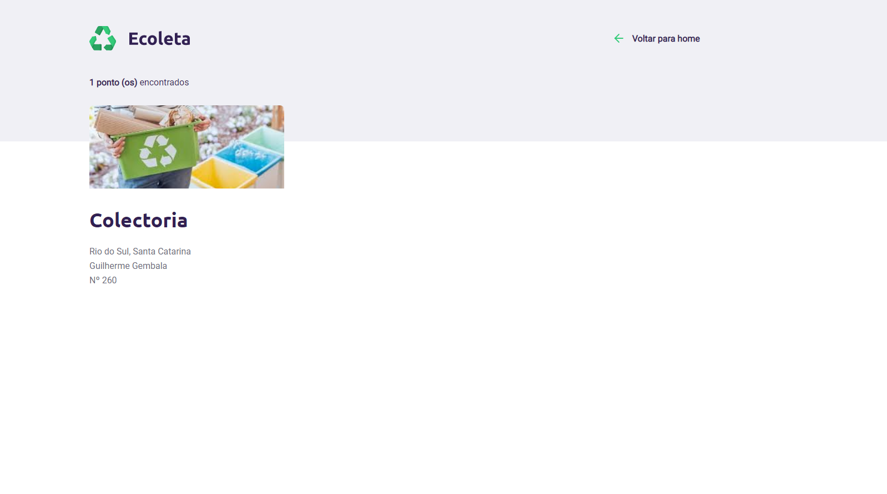

# ECOLETA

O ecoleta é um site criado acompanhando a primeira edição new level week (NLW), evento que acelera o aprendizado em programação que é realizado pela RocketSeat. 

## RocketSeat
RocketSeat é não só uma plataforma de educação em tecnologia, mais também uma comunidade de programadores.

[RocketSeat](https://rocketseat.com.br)

## Autores e instrutores da NLW

* **RocketSeat** - [RocketSeat](https://rocketseat.com.br)
* Diego Schell Fernandes - [Linkedin](https://www.linkedin.com/in/diego-schell-fernandes/?originalSubdomain=br)
* Mayk Brito - [Linkedin](https://www.linkedin.com/in/maykbrito/)

## Participação
Ao participar da NLW desenvolvi o site proposto na trilha starter ministrada pelo Mayk Brito, e nela busquei aprimorar meus conhecimentos e aprender o que foi proposto.

## Demonstração das telas
### Tela principal

### Tela de cadastro

### Tela de busca

### Tela de resultados da busca

### Tela indicando cadastro concluído

### Tela indicando falha no cadastro

Essa tela foi adicionada a mais na proposta da NLW, tendo como base a tela de cadastro concluído

# Meios de contato
## Jean Carlos De Meira

Perfil do linkedin - [Linkedin](https://www.linkedin.com/in/jean-carlos-de-meira-00593816a/)

Perfil do instagram - [Instagram](https://www.instagram.com/jean.meira10/?hl=pt-br)
